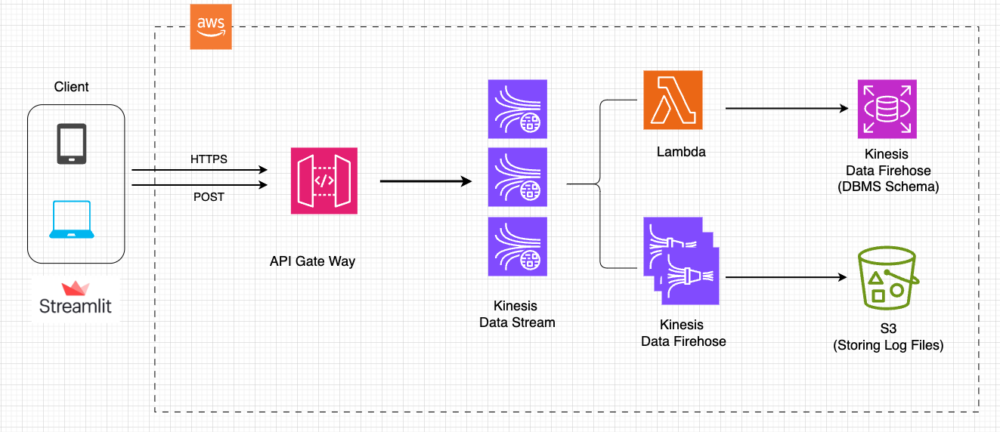
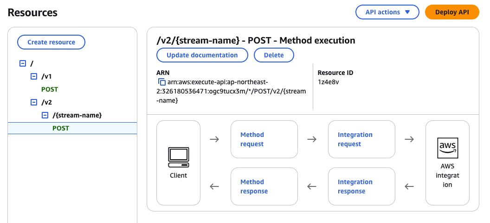
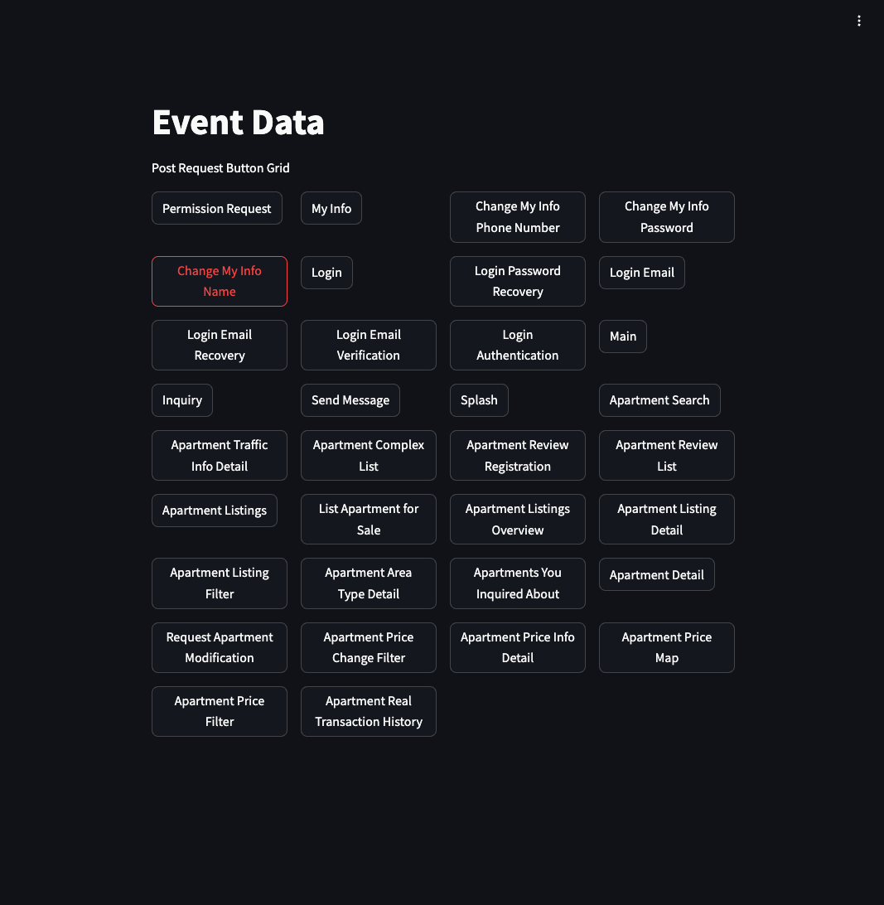

# AWS-Log-to-RDS-S3



## Clients:

- **Mobile Client and Web Client**: These devices send data to the system, such as logs or other information.

- **Streamlit**: I used Streamlit for the client side that offers an interactive UI for the users. Every button click creates a log and sends a POST request with the logs to the API Gateway.

## API Gateway:

- **Amazon API Gateway**: Acts as the entry point for incoming requests (e.g., HTTP POST). It ensures secure and efficient communication between the clients and the backend.
  - The target for the API's endpoint is the name of Amazon Kinesis Data Streams.

## Amazon Kinesis Data Streams:

- Handles real-time ingestion of the data. This component is useful for streaming large volumes of data with low latency.
- Creates topics as types of client.

## Amazon Kinesis Data Firehose:

- Takes data from Kinesis Data Streams and prepares it for delivery to S3.

## AWS Lambda:

- Processes data streams in real-time from Amazon Kinesis Data Streams. In this hands-on implementation, Lambda functions insert logs into a table in Amazon RDS.
    - Please refer to `lambda/lambda_function.py`


## **Amazon RDS**
-  Structured data is stored in a relational database using a defined schema.
## **Amazon S3**
- Raw or unstructured data is stored for long-term use or further processing.

Api Gateway template

```
#set ( $enter = "
")
#set($json = "$input.json('$')$enter")
{
"Data": "$util.base64Encode("$json")",
"PartitionKey": "$input.params('X-Amzn-Trace-Id')",
"StreamName": "$input.params('stream-name')"
}
```



how to run

```
streamlit run event_click_log.py
```


