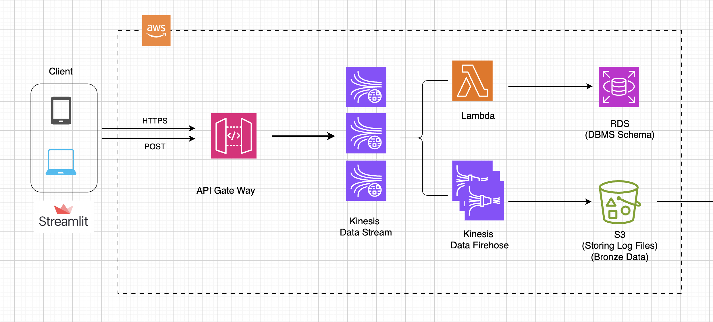

# AWS-Log-to-RDS-S3
 This project involves hands-on AWS cloud implementation to enhance skills as a data engineer. The implementation stores user log data in a database table and saves it as CSV files in Amazon S3.




## Clients:

- **Mobile Client and Web Client**: These devices send data to the system, such as logs or other information.

- **Streamlit**: I used Streamlit for the client side that offers an interactive UI for the users. Every button click creates a log and sends a POST request with the logs to the API Gateway.

## API Gateway:

- **Amazon API Gateway**: Acts as the entry point for incoming requests (e.g., HTTP POST). It ensures secure and efficient communication between the clients and the backend.
  - The target for the API's endpoint is the name of Amazon Kinesis Data Streams.
```
amazonaws.com/dev/v2/{stream-name}
```

## Amazon Kinesis Data Streams:

- Handles real-time ingestion of the data. This component is useful for streaming large volumes of data with low latency.
- Creates topics as types of client.

## Amazon Kinesis Data Firehose:

- Takes data from Kinesis Data Streams and prepares it for delivery to S3.

## AWS Lambda:

- Processes data streams in real-time from Amazon Kinesis Data Streams. In this hands-on implementation, Lambda functions insert logs into a table in Amazon RDS.
    - Please refer to `lambda/lambda_function.py`
## Data Store:

- **Amazon RDS**: Used to store user logs in a structured format. It's ideal for querying specific log details efficiently using SQL.
- **Amazon S3**: Acts as a repository for raw log data in CSV format, making it accessible for batch processing, archiving, and analytics.


# More Details

### RDS table schema
```sql
-- Create a user
CREATE USER 'pipeline'@'%' IDENTIFIED BY 'XXX#';

-- Create a database
CREATE DATABASE pipelinedb CHARACTER SET utf8mb4 COLLATE utf8mb4_general_ci;

-- Grant privileges to the user on the database
GRANT ALL PRIVILEGES ON pipelinedb.* TO 'pipeline'@'%';

-- Note the endpoint (For your reference)

-- Save data from filtering
-- Create a table
CREATE TABLE channel_marketing_tb (
    serviceType VARCHAR(50) NULL,
    gtmLongTime VARCHAR(200) NULL,
    base_dt VARCHAR(200) NULL,
    channel_name VARCHAR(200) NULL,
    conversion_name VARCHAR(200) NULL,
    platform VARCHAR(200) NULL,
    user_type VARCHAR(200) NULL
);
```

## How to run streamlit

```
streamlit run event_click_log.py
```
- UI of client


## Storing S3 applog
- Logs are categorized by date and time such like `2024/12/30/00`(year/month/date/hour)

